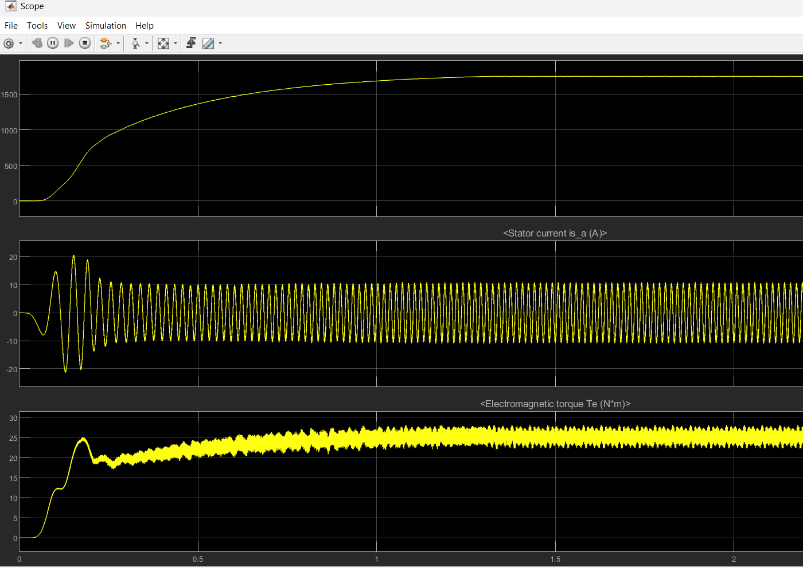
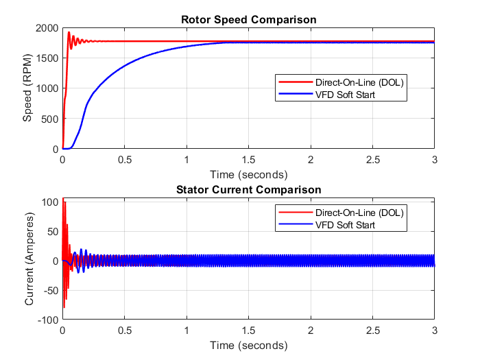

# Closed-Loop Volts-per-Hertz (V/f) Induction Motor Drive

A MATLAB/Simulink framework designed to model, simulate, and evaluate the transient and steady-state performance of a **5 HP Three-Phase Induction Machine**. This project contrasts two distinct industrial activation topologies: **Direct-On-Line (DOL)** starting and closed-loop **Variable Frequency Drive (VFD)** soft-starting.

---

## Key Engineering Insights
* **Transient Inrush Mitigation:** Successfully reduced peak startup stator current from a severe **100 A** down to a tightly bounded **23 A**, drastically lowering winding thermal stress and preventing insulation degradation.
* **Mechanical Shock Elimination:** Suppressed the destructive transient torque shocks typical of a raw grid connection, replacing them with a smoothly regulated acceleration ramp.
* **Controlled Settling Time:** Replaced the abrupt, oscillatory DOL speed jump with a stable, progressive S-curve acceleration profile that reaches full steady-state.

---

## System Architecture

### 1. Variable Frequency Drive (VFD) Pipeline
The VFD model utilizes a complete three-stage power electronics architecture:
* **Rectifier Stage:** A 3-phase universal diode bridge converting fixed grid AC into DC power.
* **DC Intermediate Link:** A parallel capacitor filter minimizing voltage ripple to establish a stable DC bus.
* **Inverter Stage:** A 6-IGBT switching matrix driven by Sinusoidal Pulse Width Modulation (SPWM).
* **Closed-Loop Control Brain:** A PI-regulated speed feedback loop that monitors rotor speed error and continuously tracks a linear Volts-per-Hertz ratio to optimize torque and prevent magnetic saturation.

### 2. Direct-On-Line (DOL) Baseline
* Configured with a decoupled three-phase source and breaker mechanism to isolate and capture unmitigated grid connection dynamics.

---

## Simulation Results

### 1. Closed-Loop VFD Transient Analysis
The multi-channel scope below tracks the isolated system responses under V/f acceleration control, capturing the rotor speed ramp, phase current envelope, and electromagnetic torque development:

### 2. Comparative Analysis (DOL vs. VFD)
Overlaying both topologies highlights the dramatic performance improvements achieved by eliminating direct-on-line grid connections:

### Performance Comparison Matrix

| Metric | Direct-On-Line (DOL) | VFD Controlled Start | Engineering Impact |
| :--- | :--- | :--- | :--- |
| **Peak Inrush Current** | **100 A** | **23 A** | Eliminates local voltage sags and thermal winding stress |
| **Starting Torque Transient** | Severe Transient Shock | Smoothly Managed | Prevents shaft shear, gear wear, and coupling shocks |
| **Acceleration Profile** | Abrupt with ringing | Smooth S-Curve  | Eradicates aggressive mechanical "jerk" on startup |

